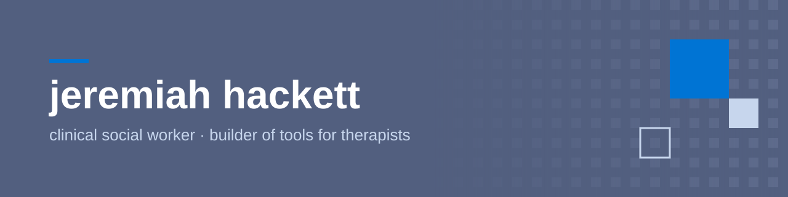
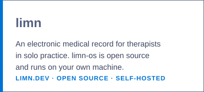
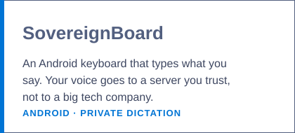

# Jeremiah Hackett

**Licensed Clinical Social Worker · Builder of tools for therapists**

I'm a licensed clinical social worker (Maine and New York) in private practice. 

Earlier this year I used Claude to make my private therapy practice *fully* self-hosted using a mix of open-source and custom tools. I enjoy working with clinicians and clinical students who care about digital sovereignty and are looking to have more agency over their digital (and professional) lives.

---

##  What I'm Building

### **Cutscene Labs**

My small company, where I build software for clinicians in solo private practice.

---

##  Tools I Use

*Tools change. What I care about is whether a tool keeps client information safe, stays in the clinician's hands, and gets out of the way of the work.*

---

##  My Practice, Self-Hosted

What a one-person therapy practice can run on without handing client data to the usual platforms:

- **Records** — limn
- **Video sessions** — on my own server
- **Email and files** — Proton
- **Tasks and calendar** — open-source tools I host myself
- **Dictation** — SovereignBoard

Every service that touches client information has signed a business associate agreement (BAA). Convenience never outranks that.

---

##  Also Here

- **[Awesome Technology for Therapists](https://github.com/jc-hackett/awesome-technology-for-therapists)** — a curated list of software for therapists and other mental-health clinicians, with a bias toward open source and privacy
- **Texts I Love** — a collection of the books and papers that shaped how I think, in the spirit of *Papers We Love*

---

##  About Me

I taught high school English and history in rural Maine before becoming a social worker. I spent the first half of my career with children and families, then moved into clinical work grounded in trauma-informed care and restorative justice. For the last eight years I've worked only with men.

I live in Amsterdam and see clients online.